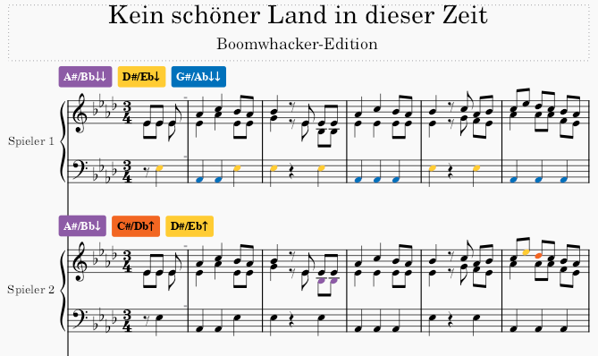

# dasd.ware Boomwhacker Colors

    

This plugin allows color noteheads with [Boomwhacker](https://en.wikipedia.org/wiki/Boomwhacker) colors. In contrast to other plugins, it is possible to select for each part, which notes should be colored. This is useful when playing with several musicians, where each one has a specific set of pipes.

## Octave naming

The plugin uses the following octave names:

| Octave | Note range  | Description                                                                                                              |
| :----: | :---------: | ------------------------------------------------------------------------------------------------------------------------ |
|  `↑­`  | `c"` - `g"` | The high register.                                                                                                       |
|  `-­`  | `c'` - `b'` | The normal register. When adding labels, the `-` will be omitted.                                                        |
|  `↓­`  |  `c` - `b`  | The low register.                                                                                                        |
| `↓↓­`  |  `C` - `B`  | The lowest register. This can be achieved by putting tube caps on the large pipes, which loweres them by another octave. |

## Recommended steps

For creating a score with multiple parts and distributing Boomwhackers between them, the following steps are recommended:

1. Create a score with a score with a single piano score containing all the notes that should be played by all players.
2. Duplicate the piano part for all the players and name them appropriately.
3. Create a part score for each part. Musescore Studio will open them as additional tabs.
4. Open the plugin dialog via `Plugins` > `Boomwhacker Colors`. The dialog pictured below will be shown. Here you can select the individual parts on the left side. On the right side, the notes available in that part are highlighted in a lighter gray. By clicking on the buttons you can toggle the note for the selected player.
5. Click `OK` to apply the changes you made. The plugin will then color all the notes in the parts according to your selection and create colored labels for each player to tell them which notes occur in their part.

The result of such an operation is shown in the following picture.

## Sections

Sections are a more advanced technique that allow to distribute notes between players based on where they are placed in the score. So the same note can be assigned to player A in the first section and to player B in the next sections.

To declare a section, specially formatted staff texts are used. Initially, a staff is in a standard section. To switch to another section, insert a staff text with content in the format `#BW <SectionName>`, where `<SectionName>` is the desired name of the section. To switch back to the standard section, use a staff text with the content `#BW` (without any section name):

In the plugin dialog, you can select the section you want to edit with the arrows beneath the note selection buttons. Distributing notes between players is then done in the same way as before.

The following picture shows a more complex coloring with multiple players playing the same note in different sections:

